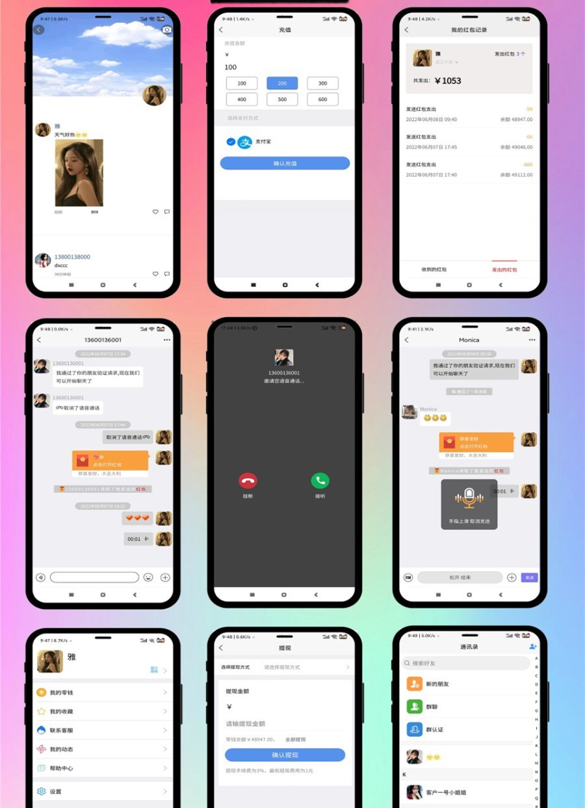

# im即时通讯聊天_红包功能_完整版

#### 介绍
IM即时通讯聊天社交APP/uniapp/+群聊+红包转账+朋友圈+在线聊天语音视频_完整源码

#### 软件架构

前端开发语言：VUE（ 安卓，IOS,WEB为一套前端代码）

服务器端开发语言: PHP+WebSocket  
数据库：MySql + mongodb  
前端打包工具：Hbuilder  
服务器搭建工具：宝塔 + SSH  
短信接口： 支持阿里云  
支付接口：支持支付宝  
服务器配置： 4核8G宽带10兆以上  
服务器系统：Linux Centos 7以上  

#### 安装教程

有详细的安装教程，傻瓜也能搭建起来。

#### 功能说明

用户之间可以相互加好友 用户可以创建自己的群组。  
支持发送 图片 视频 表情包 发红包。  
可以创建朋友圈   发表动态和视频。  
收付款，我的收藏，设置备注和标签,置顶聊天，消息免打扰，名片分享，转账记录，自定义链接。禁言，全员禁言，语音，视频聊天,发语音,发视频,群主可一键复制所有成员到新群.可匿名聊天。  

#### 截图

#### 完整源码

请移步：https://www.vipzyzh.com/?id=251

---

